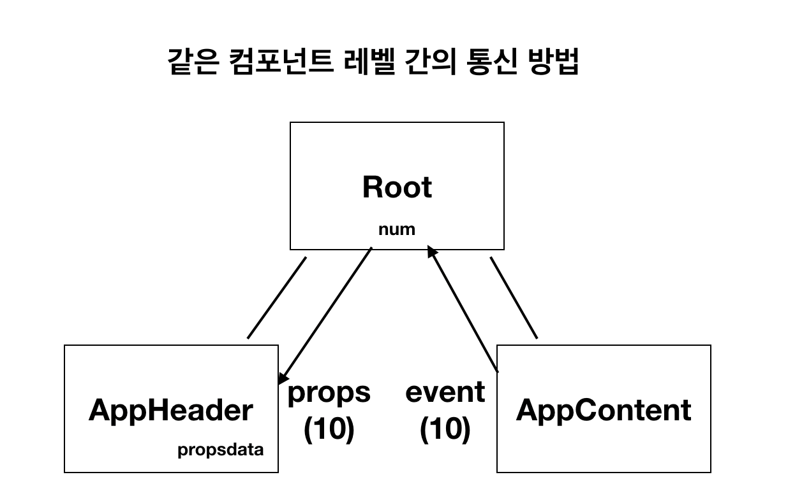

# learn-vue-js
:2020-11-25
: https://joshua1988.github.io/web-development/vuejs/vuejs-tutorial-for-beginner/#vue-routers

# vscode plug-in
- Vetur
- Night Owl
- Material Icon Theme
- Live Server
- ESLint
- Prettier
- Auto Close Tag
- Atom Keymapss

# vscode 단축키 
- 크롬 개발자도구(mac) 단축키 command + option + i 
- 패널 접기 command + w 

# 자료 참고 
- MDN 페이지 

# Vue는 무엇인가?
- MVVM(Model + View + ViewModel) 패턴의 뷰모델(ViewModel) 레이어에 해당하는 화면(View)단 라이브러리 
- DOM이 view 역할, 자바스크립트가 Model역할 
- 뷰모델이 없으면 getElementById와 같이 DOM을 직접 다뤄서 모델과 뷰를 연결해야한다. 그렇게 되면 코드양이 증가하는데, 그것을 뷰모델이 대신 수행해 주는 것이 MVVM 모델이다 

# web-dev
- 웹페이지를 단순 구성하려면 html, css, javascript를 사용 
- 선언하고 값을 바꾸면, html 값을 바꿔주는 작업이 다시 필요함 
```
var str = 'hello world';
div.innerHTML = str;

str = 'hello world!!!';
div.innerHTML = str;
```

# web-dev(reacitivity)
- 데이터 바인딩. 뷰의 핵심  
- `데이터의 변화를 라이브러리에서 감지해서 알아서 화면을 자동으로 그려줌`  
- 리액티비티를 즉시 실행 함수 표현으로 라이브러리화 할 수 있다 
  + ```
    (function () {
        statements
    })();
    ```
  + https://developer.mozilla.org/ko/docs/Glossary/IIFE

# instance 뷰 인스턴스 
- 생성 new Vue();
  + ```
    var vm = new Vue();
    console.log(vm);
    ```
- Vue 인스턴스는 다양한 기능(API)과 속성을 제공한다 
- 생성자 함수를 이용해 Vue 인스턴스에 함수를 새로 정의하면 재사용성이 높아진다 
  + 생성자 함수 만들고 인스턴스 생성
    ```
    function Person(name, job) {
        this.name = name;
        this.job = job;
    }

    var p = new Person('josh', 'developer');
    ```
    ```
    function Vue() {
        this.logText = function() {
            console.log('hello');
            }
    }
    
    var vm = new Vue();
    vm.logText;
    ```
- 인스턴스에서 사용할 수 있는 속성과 API들 
  + ```
    new Vue({
        el: , 인스턴스가 그려지는 화면의 시작점. 특정 HTML 태그
        template: , 화면에 표시할 요소. HTML, CSS 등 
        data: , 뷰의 반응성(Reactivity)가 반영된 데이터 속성 
        methods: , 화면의 동작과 이벤트 로직을 제어하는 메서드 
        created: , 뷰의 라이프 사이클과 관련된 속성 
        watch: , data에서 정의한 속성이 변화했을 때 추가 동작을 수행할 수 있게 정의하는 속성
    });
    ```
- 인스턴스를 생성하면 기본적으로 root 컴포넌트가 된다 

# 뷰 컴포넌트 
- 컴포넌트는 화면의 영역을 구분하여 개발할 수 있는 뷰의 기능.
- 컴포넌트 기반으로 화면을 개발하게 되면 코드의 재사용성이 올라가 빠르게 화면을 제작할 수 있다. 
- 전역 컴포넌트 
  + ```
    // 선언
    Vue.component('app-header', {
        template: '<h1>Header</h1>'
    });
    // 사용 
    <div id="app">
        <app-header></app-header>
    </div>
    ```
- 지역 컴포넌트 
  + ```
    new Vue({
        el: '#app', 
        components: {
            // '컴포넌트 이름', 컴포넌트 내용
            'app-footer': {
                template: '<footer>footer</footer>'
            }
        }
    });
    // 사용 
    <div id="app">
        <app-footer></app-footer>
    </div>
    ```
- 전역은 플러그인이나 라이브러리 용도로 사용하고 일반적으로 지역 컴포넌트 사용한다. 

# 컴포넌트 통신 방식 (props, event-emit)
- 뷰 컴포넌트는 각각 고유한 데이터 유효 범의를 갖는다. 
- 컴포넌트 간에 데이터를 주고 받고 위해서는 규칙을 따라야한다. 규칙없이 N 방향으로 통신을 하게되면, 특정 상태를 변경했을 때 추적하기가 어렵다 
  + 상위 컴포넌트 -> 하위 컴포넌트 (props 속성)
  + 하위 컴포넌트 -> 상위 컴포넌트 (이벤트 발생)
  + 같은 레벨에서의 컴포넌트 통신 하려면 상위 컴포넌트를 거쳐서 보내야함
  
## `props`
  + `<app-header v-bind:하위 프롭스 속성 이름="상위 컴포넌트의 데이터 이름"></app-header>`
  + 상위 컴포넌트(root) -> 하위 컴포넌트(appHeader)로 props
  + ```
    <div id="app">
        <app-header v-bind:propsdata="message"></app-header>
    </div>
    <script>
        var appHeader = {
                template: '<h1>{{propsdata}}</h1>', 
                props: ['propsdata']
            }

        new Vue({
            el: '#app', 
            components: {
                'app-header': appHeader
            }, 
            data: {
                message: 'hi'
            }
        })
    </script>
    ```
## event emit
 + `<app-header v-on:하위 컴포넌트에서 발생한 이벤트 이름="상위 컴포넌트의 메서드 이름"></app-header>`
 + 하위 컴포넌트(root) -> 상위 컴포넌트(appHeader)로 event emit
 + ```
    <div id="app">
        <app-header v-on:pass="logText"></app-header>
    </div>
    <script>
        var appHeader = {
            template: '<button v-on:click="passEvent">click me</button>', 
            methods: {
                passEvent: function() {
                    this.$emit('pass');
                }
            }
        }

        new Vue({
            el: '#app', 
            components: {
                'app-header': appHeader
            }, 
            methods: {
                logText: function() {
                    console.log('hi');
                }
            }
        });
    </script>
   ```
- * 뷰 인스턴스에서 this는 해당 뷰 인스턴스의 data를 가리킨다 
  + ```
    new Vue({
        el: '#app', 
        components: {
            'app-content': appContent
        }, 
        methods: {
            plusNum: function() {
                console.log(this.num++);  // --> data의 num
            }
        }, 
        data: {
            num: 10
        }
    });
    ```

# 뷰 라우터 
- 뷰 라우터는 뷰 라이브러리를 이용해 SPA 구현할 때 사용하는 라이브러리이다. 
- CDN `<script src="https://unpkg.com/vue-router/dist/vue-router.js"></script>`
- 생성 
  + ```
    var router = new VueRouter({
        routes: [
            {
                // 페이지의 url, 해당 url에서 표시될 컴포넌트 
                path: '/login', 
                component: LoginComponent
            }, 
            {
                path: '/main', 
                component: MainComponent
            }, 
            //mode: 'history' url에 #을 제거. #/login -> /login
        ] 
    })

    new Vue({
        el: '#app', 
        router: router
    })
    ```
- 컴포넌트가 표시되는 영역은 router-view 태그로 설정한다. 뷰 인스턴스에 연결해야 사용할 수 있다  
- 특정 페이지를 이동할 수 있게 해주는 태그는 router-link 이다. 
  + `<router-link to="이동할 URL"><</router-link>`

# 액시오스 axios
- 뷰에서 권고하는 HTTP 통신 라이브러리이다. Promise 기반의 HTTP 통신 라이브러리이고 문서화가 잘 되어있다. 
- CDN `<script src="https://unpkg.com/axios/dist/axios.min.js"></script>`
  + Promise based HTTP client for the browser and node.js 
  + 뷰 리소스 대신 사용. 
- Promise
  + 자바스크리트 비동기 처리 패턴 
  + callback
  + promise 
  + promise + generator 
  + async & await 
- ```
  axios.get('https://jsonplaceholder.typicode.com/users/')
    .then(function (response) {
        console.log(response);
    })
    .catch(function (error) {
        console.log(error);
    });
  ```

# 템플릿 문법 
- 데이터 바인딩 
  + {{ message }}
- 뷰 디렉티브. v-xx 속성들  
  + v-bind 
  + v-if 
  + v-show
  + v-on
- `https://vuejs.org/`

# watch vs computed
- watch 속성 
  + 매번 실행되는게 부담스러운 무거운 로직들.
  + 데이터 요청들 
- computed 
  + 기준이 되는 속성을 계속 계산해서 보여준다 
  + 단순한 값에 대한 계산 
- `https://vuejs.org/v2/guide/computed.html#ad`

# Vue CLI 
- Vue CLI는 커맨드라인 인터페이스 명령어 실행 보조 도구. 
## Vue CLI 설치 
+ node -v, npm -v 확인 
+ `sudo npm install -g @vue/cli`
## Vue CLI 프로젝트 생성 및 서버 실행 
+ `vue create vue-cli`  
+ cd vue-cli
+ npm run serve

# 싱글 파일 컴포넌트 Xx.vue
- vue + tab 
  + ```
    <template>
        <!-- HTML -->
    </template>

    <script>
    export default {
        // javascript - 인스턴스 옵션
    }
    </script>

    <style>
    /* CSS */
    </style>
    ```
- 기존 코드를 파일로 분리하면 다음과 같다.     
  + ```
    var appHeader = {
        template: '<div>header</div>', 
        methods: {
            addNum: function() {
                
            }
        }
    }
    ```
  + ```
    <template>
        <div>header</div>
    </template>

    <script>
    export default {
        methods: {
            addNum: function() {
                
            }
        }
    }
    </script>

    <style>
    </style>
    ```
- template 안에서는 루트 메서드가 하나여야 한다. 
  + X
    ``` 
    <template>
        <div></div>
        <div></div>
    </template>
    ```
  + O
    ``` 
    <template>
        <div>
            <div></div>
        </div>
    </template>
    ```  
- 최신 뷰에서는 `data: { num : 10}` 대신 `data: function() { return num: 10 }`로 해야함 
